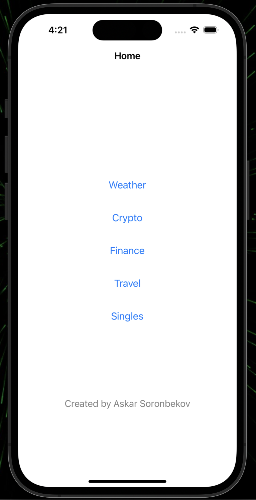
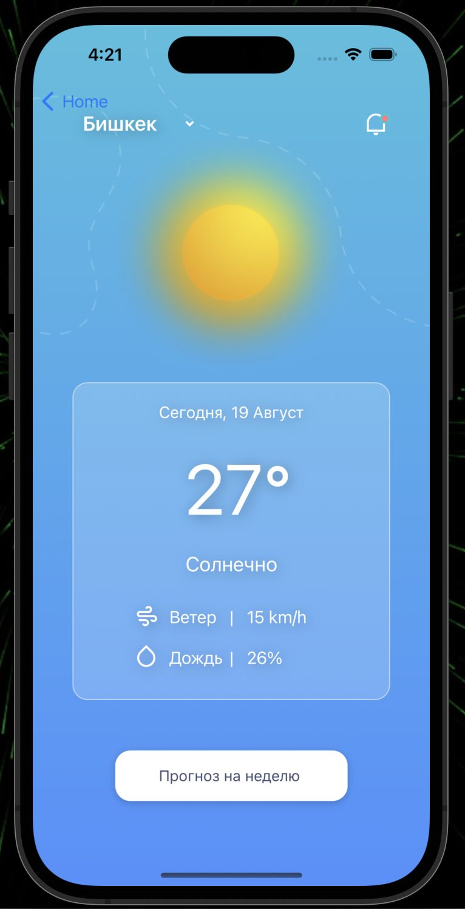
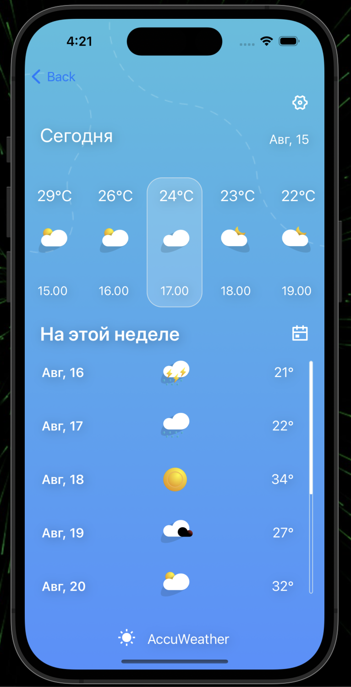
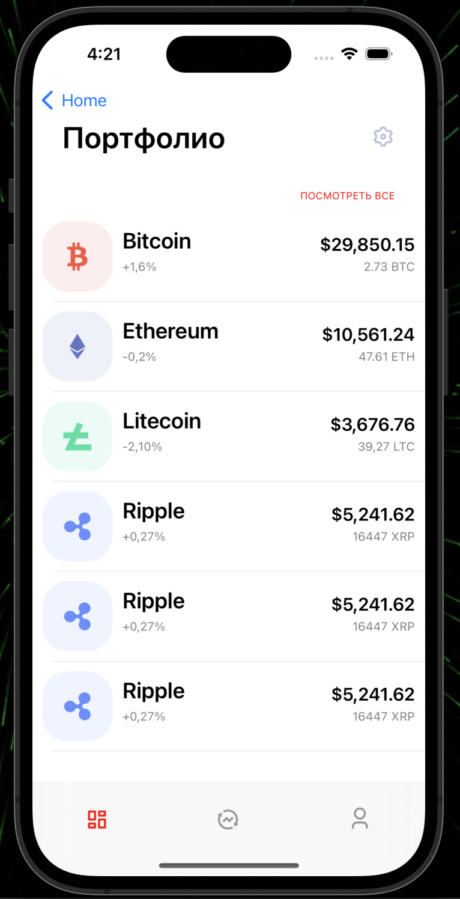
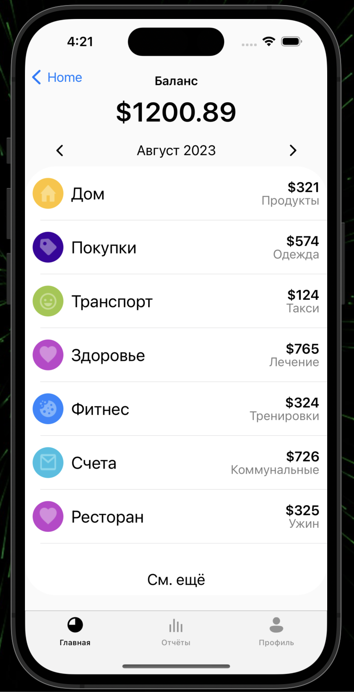
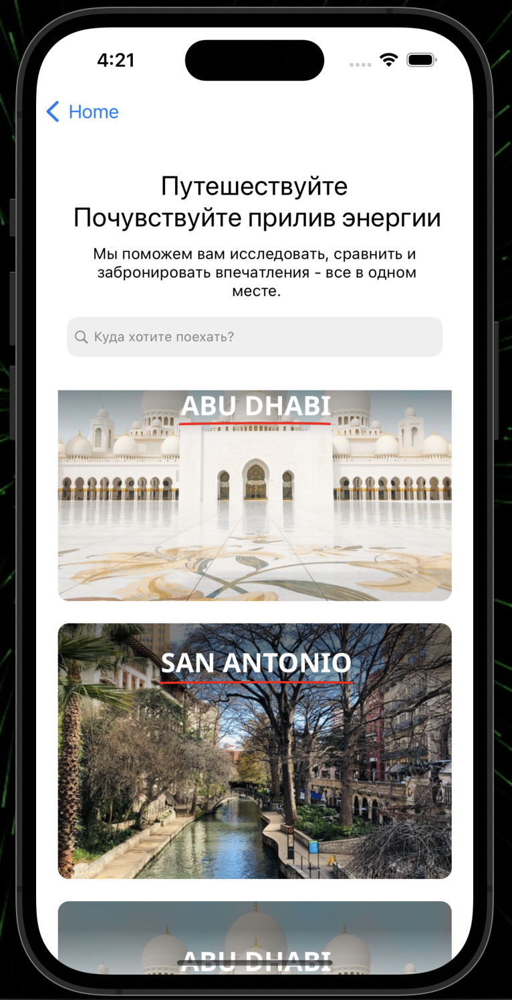
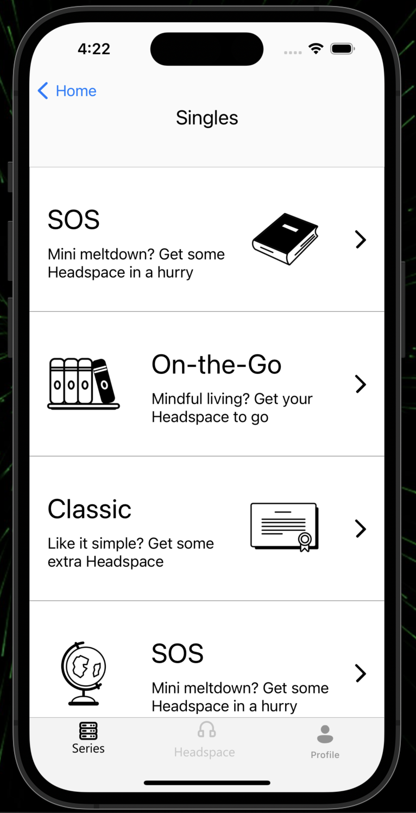

# Neobis_iOS_UIScreens

UIScreens
 

  

## Features
This project contains 6 screens and various buttons to navigate to different sections(pages) of the app created without storyboard.

## Features

- Display buttons for different sections:
  - Weather
  - Crypto
  - Finance
  - Travel
  - Singles

## How to Use

1. Run the app using the Xcode simulator or a real iOS device.

2. The home screen will display buttons for different sections.

3. Tap on a button to navigate to the corresponding section of the app.

UIScreens

<table align="center">
  <tr>
    <th>Current Weather Page</th>
    <th>Week Weather Page</th>
    <th>Crypto Page</th>
  </tr>
  <tr>
    <td></td>
    <td></td>
    <td></td>
  </tr>
</table>

UIScreens

<table align="center">
  <tr>
    <th>Finance Page</th>
    <th>Travel Page</th>
    <th>Singles Page</th>
  </tr>
  <tr>
    <td></td>
    <td></td>
    <td></td>
  </tr>
</table>
